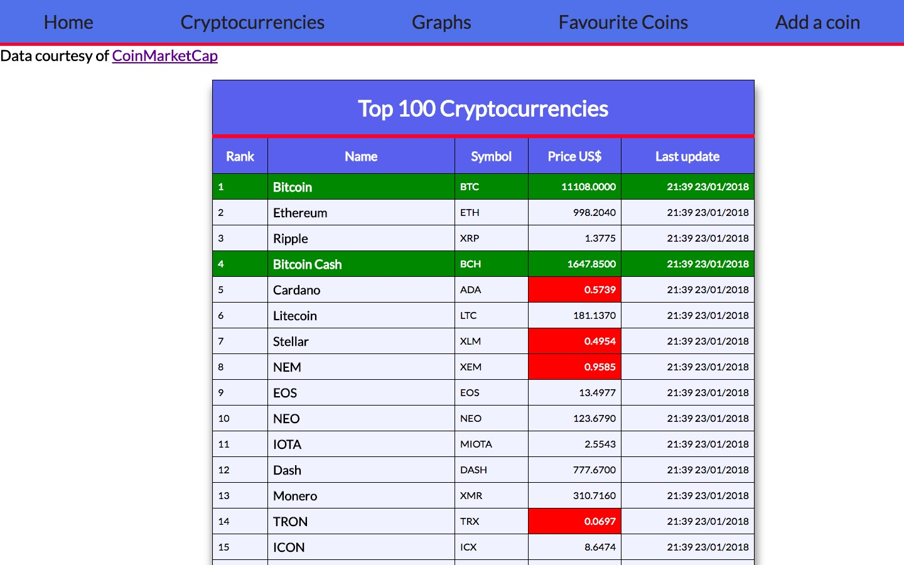
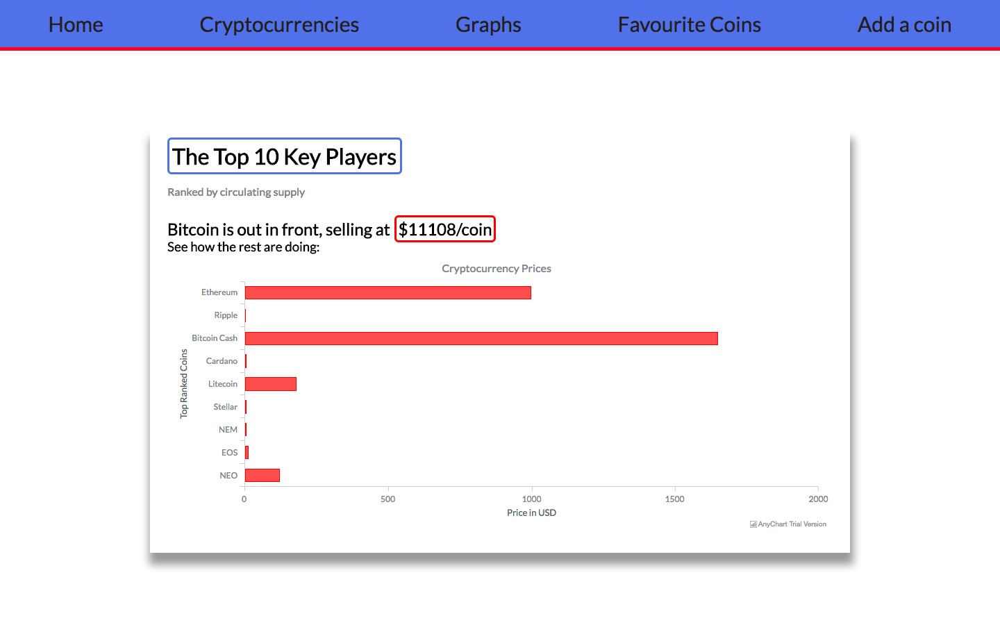

# rubyBitcoinProject
A mini-project using Ruby, Sinatra, a Cryptocurrency API and AnyChart


# Name of the project
> Additional information or tag line

A brief description of your project, what it is used for.

## Installing / Getting started

App runs on localhost:4567

```
psql -d coin_tracker -f db/cointracker.sql
ruby seeds.rb to seed the db
psql
\c coin_tracker to connect to db
ruby app.rb to start Sinatra

```

## Developing
API used: https://coinmarketcap.com/ (no API key needed)

### Built With
Ruby, Sinatra, postgreSQL, AnyChart, hashie, React:Client




